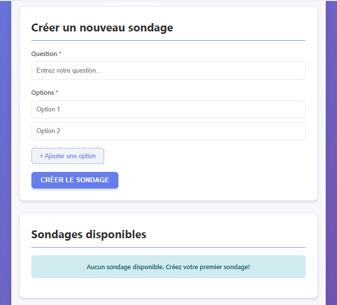

# Simple_Survey

## Description
Application web permettant de créer des sondages simples et de voter pour différentes options avec affichage des résultats.  
Ce projet est le **trente-neuvième** du défi personnel **100 projets en 2026**.

---

## Objectifs du projet
- Implémenter un système de vote
- Gérer des données structurées (question + options)
- Compter et afficher des résultats
- Mettre à jour l’interface dynamiquement
- Empêcher les votes multiples (logique locale)

---

## Plateforme
- Web (navigateur)

---

## Technologies utilisées
- HTML
- CSS
- JavaScript (Vanilla)
- LocalStorage

---

## Fonctionnalités
- Création d’un sondage (question + options)
- Vote pour une option
- Affichage du nombre de votes
- Blocage du vote multiple (local)
- Sauvegarde des données

---

## Design & UX
- Question bien visible
- Options cliquables
- Résultats clairs (texte ou barres)
- Interface simple et interactive
- Responsive (mobile et desktop)

---

## Captures d’écran

---

## Ce que j’ai appris
- Gestion d’un système de vote
- Manipulation de données dynamiques
- Mise à jour du DOM en temps réel
- Logique de restriction (1 vote)
- Structuration d’une app interactive

---

## Améliorations possibles
- Affichage en pourcentage
- Barres de progression
- Plusieurs sondages
- Suppression d’un sondage
- Graphiques

---

## Statut du projet
 **Projet terminé**